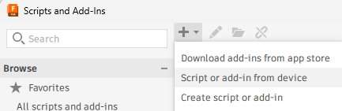
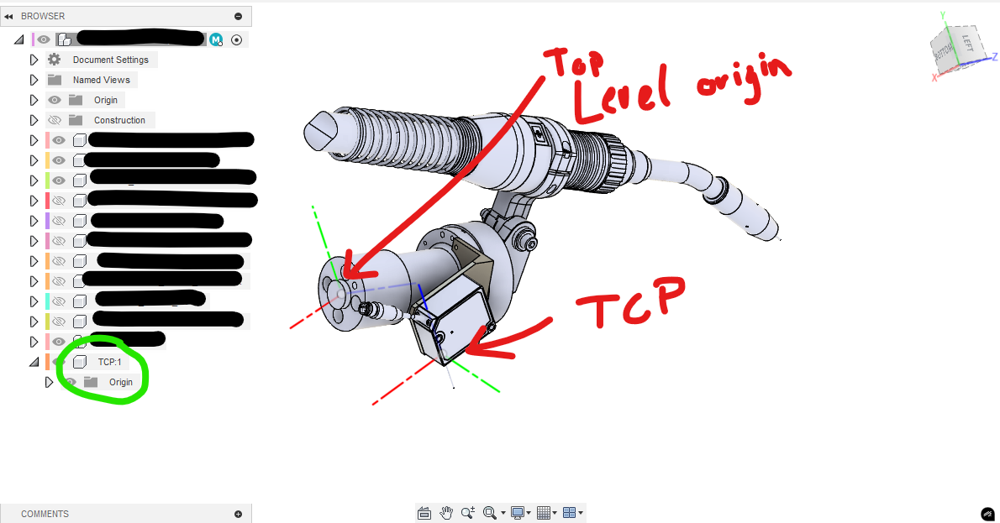
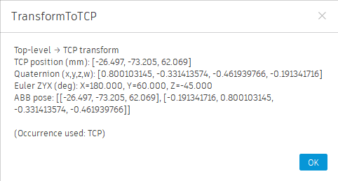

# fusion360robotics
This repository contains useful scripts to use with Autodesk Fusion 360 for robotics use.

## Installation 
To add the individual scripts follow the [autodesk instrutions](https://help.autodesk.com/view/fusion360/ENU/?guid=SLD-MANAGE-SCRIPTS-ADD-INS). The folder containing the python files can be added (see image)

## Script library
### Tool Center Point (TCP) transform calculator
Calculates the transform from the top level component to an empty internal component called TCP (which should be aligned to the desired orientation in fusion 360 manually)

## Other useful tools
- [3D Transform visualization tool](https://dugas.ch/transform_viewer/multi.html)
- [URDF Exporter](https://github.com/syuntoku14/fusion2urdf)
- [URDF Exporter ROS2](https://github.com/dheena2k2/fusion2urdf-ros2)